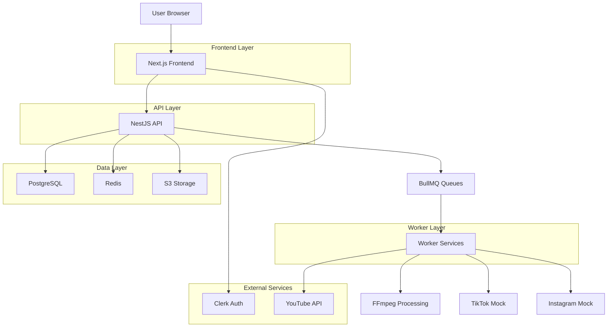

## 1. Architecture design



## 2. Technology Description

- **Frontend**: Next.js 14 + TypeScript + Tailwind CSS + shadcn/ui + React Hook Form + Zod
- **Initialization Tool**: create-next-app
- **Backend**: NestJS + TypeScript + Swagger + Prisma
- **Database**: PostgreSQL (via Prisma ORM)
- **Cache/Queue**: Redis (BullMQ)
- **Storage**: S3-compatible (Cloudflare R2)
- **Auth**: Clerk
- **Monorepo**: pnpm workspaces
- **Worker**: Node.js + FFmpeg + BullMQ

## 3. Route definitions

| Route | Purpose |
|-------|---------|
| / | Landing page avec hero section et CTA |
| /dashboard | Vue d'ensemble du workspace et projets |
| /projects/[id] | Détail du projet avec navigation secondaire |
| /projects/[id]/connections | Gestion des connexions sociales |
| /projects/[id]/library | Bibliothèque de médias |
| /projects/[id]/autopilot | Configuration de l'autopilot |
| /projects/[id]/content | Timeline des contenus |
| /projects/[id]/analytics | Tableau de bord analytics |
| /settings | Configuration du workspace |
| /settings/billing | Gestion de la facturation |

## 4. API definitions

### 4.1 Health Check
```
GET /api/health
```
Response:
```json
{
  "status": "ok",
  "timestamp": "2024-01-01T00:00:00Z",
  "services": {
    "database": "healthy",
    "redis": "healthy",
    "storage": "healthy"
  }
}
```

### 4.2 Workspaces
```
POST /api/workspaces
```
Request:
| Param Name | Param Type | isRequired | Description |
|------------|------------|------------|-------------|
| name | string | true | Nom du workspace |
| slug | string | true | Identifiant unique |

Response:
```json
{
  "id": "uuid",
  "name": "My Workspace",
  "slug": "my-workspace",
  "createdAt": "2024-01-01T00:00:00Z"
}
```

### 4.3 Projects
```
POST /api/projects
```
Request:
| Param Name | Param Type | isRequired | Description |
|------------|------------|------------|-------------|
| workspaceId | string | true | ID du workspace |
| name | string | true | Nom du projet |
| description | string | false | Description optionnelle |

### 4.4 Media Upload
```
POST /api/media/upload-url
```
Request:
| Param Name | Param Type | isRequired | Description |
|------------|------------|------------|-------------|
| filename | string | true | Nom du fichier |
| contentType | string | true | Type MIME |
| size | number | true | Taille en bytes |

Response:
```json
{
  "uploadUrl": "https://s3.presigned-url",
  "key": "media/uuid/filename.mp4",
  "expiresAt": "2024-01-01T01:00:00Z"
}
```

### 4.5 Autopilot Configuration
```
PUT /api/autopilot/:projectId
```
Request:
| Param Name | Param Type | isRequired | Description |
|------------|------------|------------|-------------|
| cadence | string | true | "daily" \| "weekly" |
| language | string | true | Code langue ISO |
| style | string | true | "minimal" \| "neon" \| "corporate" |
| objective | string | true | "traffic" \| "awareness" \| "conversion" |
| timeWindows | array | true | ["12:00-14:00", 